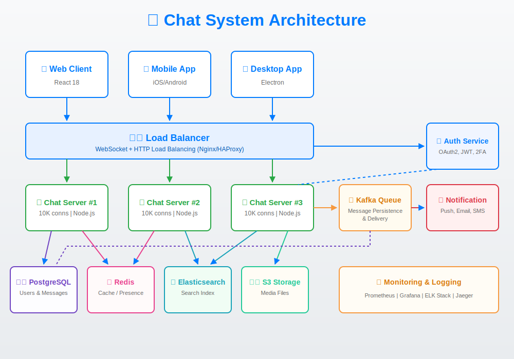

# Chat System

Full-featured, scalable chat system with real-time delivery, direct and group messaging, typing indicators, and message read receipts.

## ✨ Key Features

- **JWT Authentication** - Secure login and registration.
- **WebSocket Real-Time Updates** - Instant message delivery via Socket.IO.
- **One-to-One & Group Chats** - Flexible conversation models.
- **Message Status** - Sent, delivered, read states.
- **Typing Indicators** - Real-time activity feedback.
- **Message Edit & Delete** - Full control over your history.

## 🚀 Advanced Next-Gen Features (Added)

- **End-to-End Encryption (E2EE)** - Support for securely encrypting messages on the client side.
- **Ephemeral (Self-destructing) Messages** - Messages that vanish after a certain time.
- **Smart AI Assistant** - Built-in chatbot integration for smart replies and moderation.
- **Rich Media & File Sharing** - S3-compatible cloud storage integration.
- **Elastic Search** - Fast, full-text message search across millions of records.

## 🏗️ Architecture

Built for high availability and millions of concurrent connections:
- **Client** - React 18, React Native, Electron
- **Load Balancer** - Nginx / HAProxy WebSocket balancing
- **Chat Nodes** - Scalable Node.js & Express.js instances
- **Message Broker** - Kafka for persistent delivery & async processing
- **Databases** - PostgreSQL (core DB), Redis (cache & presence), Elasticsearch (search)
- **Storage** - AWS S3 for media

## 🛠️ Quick Start

`ash
# Backend
cd backend
npm install
npm run dev

# Frontend
cd ../frontend
npm install
npm start
`
